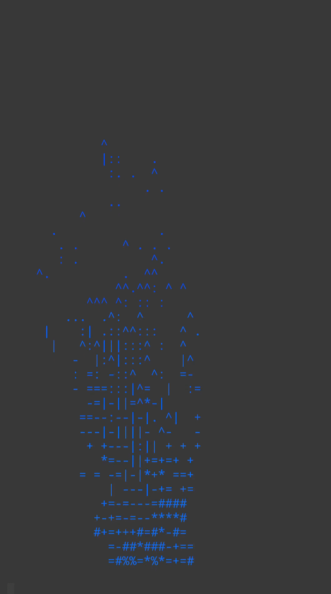

**MAIN INFO**

# 🔥 Fɪʀᴇ "Sɪᴍᴜʟᴀᴛion"
 

  
   

This project is about **fire**, yes **fire**. It was a _simple_ simulation! Created by [me](https://github.com/Skokoo), this project was fully developed using **_mobile_**. This is my first project!

Using The _C++ language!_ I made this just for **fun**!  

Oh yeah! I'm self-taught, relying solely on learning app(Just a while, and than not again), and, i learned with my [24/7 teacher that never sleep](https://www.google.com). Me no drink coffe while coding btw.

# 🔗 Main Links!
This is the _**code**_ im using! me like using "some" _Obfuscated code._

• [🔥 FireCode](https://github.com/Skokoo/Firere/blob/main/FireSim.cpp) 

And this is the _explanation!_( of the code )

• [🤔 Explanation](https://github.com/Skokoo/Firere/blob/main/Code%20explanation)

• [🚀 Fast Explanation](https://github.com/Skokoo/Firere#-fast-explanationoptional)

If you want more explantion(Full),please go to the bottom.
Optional code:

• [🗨 Discussion Link](https://github.com/Skokoo/Firere/discussions/2)

# 📷 Cᴏᴅᴇ Oᴜᴛᴘᴜᴛ!

  
   
  <b>Output</b>

# 🏃 How To run it!
_Copy the Repo_, make sure the terminal/C++ compiler supports **ANSI/ASCII**.(And also a big screen(optional)).

# 📃 License
License = This project use the GPL-v3 license.
For a short explanation, please [click](https://github.com/Skokoo/Firere/blob/main/License%20Short%20Explanation) this.

.

.

.

.
_____________________________________________
# Is this even a info? 

My "Info" eat my phone.

# 🤓 How?(Explanation2)
(Why me put here)

• Number : **0-30**, based how hot the _"heat"_ is, **it would be picking the small "char"**if the fire is "cold", on the other hand, **it would be picking big "char"**.
<pre>"gugu += (HMM > 0) ? chars[min((int) chars.size()-1, HMM/3)] : ' ';"</pre>

>if you find this **cool**, feel free to leave a ⭐️!
>**_(optional)_**

**🌀 Fast Explanation(Optional)**
--------------------
**Heyo! go call more Stars!**
<pre>while(true) {
        int RANDOMA = 0; 
        while(RANDOMA < WAWI) {
            if ( RANDOMA > WAWI/3 && RANDOMA < 2*WAWI/3)  fire[(GUGI - 1)* WAWI + RANDOMA] = 15 + rand() % 15;</pre>
Ok sir, here we go, a Bright Stars. But they want to "eat"(fuel) first.(WHY IS IT 0?)
<pre>else fire[(GUGI - 1) * WAWI + RANDOMA] = 0;  
            RANDOMA++; </pre>
ok..**Charge!!!**
<pre>for(int UP1 = 0; UP1 < GUGI-1; UP1++) { 
        for(int UP2 = 0; UP2 < WAWI; UP2++) {
                int DIRECTION = Wind;  
                int HEATP = Fire; 
                int DEST = UP1 * WAWI + ( UP2 + DIRECTION - 1 + WAWI) % WAWI;
                int LASTED = spell; 
                fire[DEST] = over; </pre>

**why is their light dimmed when they got there? And they are gone out of nowhere?**
<pre>_"gugu += (HMM > 0) ? chars[min((int) chars.size()-1, HMM/3)] : ' ';"_
And
int LASTED = spell; 
                fire[DEST] = over;</pre>

_**CALL MORE STARS. ⚠️☄️**_
(Repeat, but remember, he want to sleep 50 miliseconds first)
<pre>#define take_some_rest std::this_thread::sleep_for(std::chrono::milliseconds(50));</pre>   
---------------------------------------------
"C" language rank.
this is my personal opinion(pls dont hate me)

| Name | Rank | Why |
| :--- | :--- | :---|
| **C++:** | dont know | yes |
| **C:** | dont know | yes |
| **C#:** | dont know | yes |

• This project is WIP.

